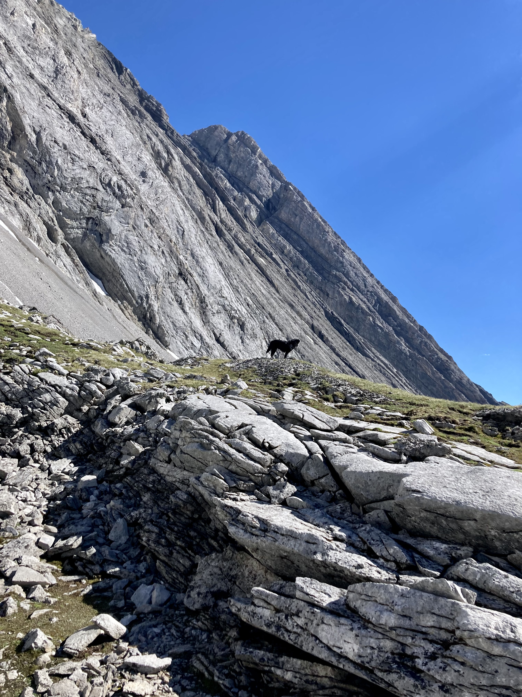

# Demonstration markdown file 
My current test-bed to mess about with various markdown features. Ideally, this document should be preview-able by typing `:MarkdownPreview`. I'll try to include most features I find useful as a reference, as this'll be how I intend to take notes for classes next year forwards.

Reminder to future self - `cmd + shift + f` on chrome will toggle view for tabs and stuff.

Это предложение на русском, чтобы убедиться, что оно работает.

	
## One block of code, and three very cool emojis 👉😎👉

```glsl
vec3 render(vec3 pos, vec3 dir, vec2 seed){
	vec3 summed = vec3(0.0);
	vec3 factional = vec3(1.0);
	
	for(int i=0;i<DEPTH;i++){
		DistIden ray = raycast(pos, dir, FAR_PLANE);
		// fall out criteria
		if(ray.iden == SKY_MAT) {
		   if(i==0) return skyColour(dir);
		   break;
		}
		//update normal and pos
		pos += ray.dist * dir;
		vec3 nor = calcNormal(pos);
		pos += nor * EPSILON1; 
		
		// loop unpacks to surface_1(direct_1 + surface_2(direct_2 + surface_3(direct_3 + ... ) ) )
		factional *= renderMaterial(ray.iden);
		summed += factional * worldLighting(pos, nor, seed);
		dir = cosDir_tuv(nor, seed);
	}
	return summed;
}
```
<br>

### Collapsible
<details><summary>The following section is collapsed</summary>

tada.
</details>

### An equation: 

$\displaystyle \frac{1}{\Bigl(\sqrt{\phi \sqrt{5}}-\phi\Bigr) e^{\frac25 \pi}} = 1+\frac{e^{-2\pi}} {1+\frac{e^{-4\pi}} {1+\frac{e^{-6\pi}} {1+\frac{e^{-8\pi}} {1+\cdots} } } }$

Formatting uses katex.

### Lists: 
Some elements
1. item
2. item
- item
- item

<br><br><br>

## Images:

### Local reference:


### Web reference:

